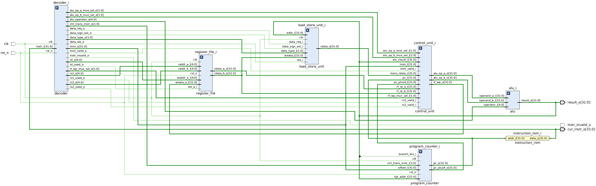

# toothless 

Single stage RV32I processor core. 




## Mission

- design  minimal RV32I core
- test it - verilator
- do logic synthesis - yosys
- do physical synthesis - yosys
- try SystemVerilog assertions


# Simulation cocotb (Python) + Verilator (Verilator >= 5.22)

Setup Verilator Path 

```
export VERILATOR_ROOT=/home/jscha/projects/verilator
export PATH=$VERILATOR_ROOT/bin:$PATH
export PATH=/home/jscha/.config/mlonmcu/environments/default/deps/install/riscv_gcc/bin:$PATH
export PATH="/home/jscha/projects/oss-cad-suite/bin:$PATH"
```

Check for Syntax Errors
```
make lint DUT=decoder
```

Run Simulation

```
cd rtl
make DUT=alu
```


View Waveform (uses GTKwaves)
```
make waves
```

## Simulate Hex File / Assembly

create test.hex from test.s
```
make bin ASM_TEST=alu
```
run test.hex
```
make DUT=if_id_ex_stage
```


# Synthesis Yosys

- uses synthesis script `synthesis/syn.sh`
- Need to manually specify source files inside script

Get yosys statistics
```
cd rtl
make stats
```

perform logic synthesis with default library
```
cd synthesis
./syn.sh
```


